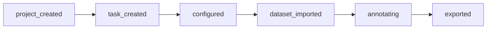

# 标注业务完整流程梳理

## 流程结论

当前你提出的流程“创建任务 → 配置 → 导入数据集 → 标注 → 导出”没有异议，是标准且可落地的生产流程。

## 流程阶段定义

1. 创建任务（Project/Task）
   - 输入：项目、任务名称、执行人、优先级
   - 输出：可执行任务（taskId）

2. 任务配置（Config）
   - 输入：自动保存间隔、是否强制审核、单图最大目标、质量阈值、是否允许跳过
   - 输出：任务配置快照（configVersion）

3. 数据集导入（Import）
   - 输入：数据集名称、图像数量、格式信息
   - 输出：导入任务（importJobId）与可标注图像集合

4. 标注执行（Annotate）
   - 输入：图像 + 工具 + 标签体系 + 属性配置
   - 输出：标注结果（对象列表、标签绑定、属性）

5. 结果导出（Export）
   - 输入：项目/任务范围、导出格式（COCO/VOC/YOLO）
   - 输出：导出任务（exportJobId）与下载链接

## 状态流转

## 前端落地策略

- 在项目管理页完成“任务创建+配置+导入+导出”管理。
- 在标注页专注“标注执行”与标注结果编辑。
- 使用流程快照驱动看板进度，统一显示当前阶段。

## 项目与任务关系说明

- 项目：业务容器，负责承载标签体系、质量规则、数据范围和交付目标。
- 任务：执行单元，负责把项目中的数据批次分配给具体执行人，并形成可追踪的产能与审查记录。
- 推荐流程：先项目后任务，再进入标注。
- 可选流程：允许“快速标注”（仅绑定项目不绑定任务），用于临时标注或验证，不建议用于正式协作交付。
