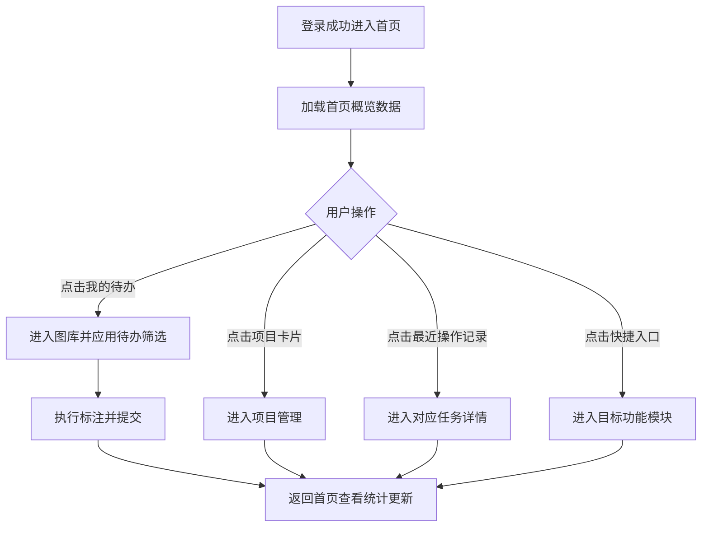

# 标注平台首页功能模块设计方案

## 1. 核心业务场景与首页关键信息模块

### 1.1 核心业务场景

- 项目负责人查看全局进度与风险项目
- 标注员进入个人待办并快速开始标注
- 审核员跟踪待审核任务与质量回退
- 管理员观察产能、在线人数与系统健康

### 1.2 首页模块拆分

- 项目概览模块
- 任务统计模块
- 用户工作台模块
- 快捷入口模块
- 最近操作记录模块
- 资源与系统状态模块

## 2. 模块指标定义与展示形式

### 2.1 项目概览模块

- 指标：项目总数、进行中项目数、延期项目数、已完成项目数
- 展示：4个数字卡片 + 项目进度排行列表

### 2.2 任务统计模块

- 指标：待标注数、标注中数、待审核数、已通过数、今日完成数
- 展示：数字卡片 + 进度条 + 日趋势折线占位

### 2.3 用户工作台模块

- 指标：我的待办、今日目标完成率、最近分配任务
- 展示：待办列表卡片 + 个人进度条 + 优先级标签

### 2.4 快捷入口模块

- 指标：进入图库、进入项目管理、进入审查、进入导入导出
- 展示：按钮宫格，带图标与说明

### 2.5 最近操作记录模块

- 指标：最近20条操作（登录、提交标注、审核结论、导出）
- 展示：时间轴列表（时间+操作类型+对象）

### 2.6 资源与系统状态模块

- 指标：在线人数、队列积压、接口成功率、平均响应时延
- 展示：状态标签 + 小型趋势文本

## 3. 数据获取策略与API接口规范

### 3.1 刷新分层策略

- 实时数据（5秒轮询）：待办数量、队列积压、在线人数
- 准实时数据（30秒缓存）：任务统计、个人工作台
- 冷数据（60秒缓存）：项目概览、快捷入口配置、最近操作

### 3.2 缓存策略

- 内存缓存：页面会话级缓存，避免重复请求
- SessionStorage缓存：刷新后可恢复首页状态
- 图库图片缓存：分页结果缓存 + 图片URL预热缓存

### 3.3 API规范（建议）

- `GET /api/home/overview`：项目概览与核心统计
- `GET /api/home/tasks`：任务状态统计
- `GET /api/home/workbench`：用户工作台
- `GET /api/home/activities?limit=20`：最近操作
- `GET /api/home/system`：系统状态
- 通用响应：`{ code, msg, data, time }`

## 4. 首页到核心功能的交互流程图

## 5. 技术实现要求

### 5.1 布局规则

- Desktop ≥1200：三列布局（概览+工作台+系统状态）
- Tablet 768\~1199：两列布局
- Mobile <768：单列堆叠，关键卡片优先显示

### 5.2 加载与异常状态

- 卡片统一骨架屏（Skeleton）
- 列表统一Spin加载状态
- 空数据统一Empty组件与引导文案
- 请求失败显示Alert并自动降级到Mock数据

### 5.3 可用性要求

- 所有按钮具备明确文案与图标
- 键盘可达（Tab顺序正确）
- 文本对比度满足AA

## 6. 性能指标要求

- 首屏加载时间 ≤ 2s（局域网/内网条件）
- 首次可交互时间 ≤ 2.5s
- 首页关键数据更新延迟 ≤ 5s
- 列表滚动保持60FPS目标，最低30FPS
- 页面内存稳定，无持续增长趋势

## 7. 开发与验收清单

- 首页模块渲染与路由跳转可用
- 数据实时/缓存策略按分层生效
- 图库分页数据与图片缓存生效
- 构建通过且无TypeScript错误
- 关键场景演示：从首页进入图库、项目管理并返回

